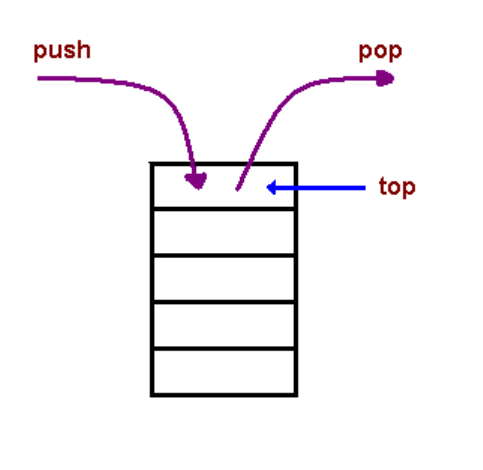

## Understanding the JavaScript Call Stack: https://www.freecodecamp.org/news/understanding-the-javascript-call-stack-861e41ae61d4/

**What is a ‘call’?**

Function invocation.

**How many ‘calls’ can happen at once?**

One at a time as the call stack is a single stack, top to buttom, synchronously.

**What does LIFO mean?**

Last In, First Out. The last function that was put into the stack is the first one out, like placing things in a bucket, you can see and reach for the item in the top of the bucket first.

**Draw an example of a call stack and the functions that would need to be invoked to generate that call stack.**

This drawing is straight from the reading and credited to Carnegie Mellon University.

**What causes a Stack Overflow?**

When recursion occurs due to a function calling itself without an exit.

## JavaScript error messages: https://codeburst.io/javascript-error-messages-debugging-d23f84f0ae7c

**What is a ‘reference error’?**

An attempt to use a variable that hasn't been declared yet.

Sometimes fixed by declaring the variable and then assigning it.

**What is a ‘syntax error’?**

When the logical syntax of the statement is invalid.

**What is a ‘range error’?**

Working with an object and trying to give it an invalid length.

**What is a ‘type error’?**

Most common error: When the type of variable you're trying to access is incompatible.

e.g. undefined or undeclared

**What is a breakpoint?**

A debugging statement placed in a specific line of code that will stop if a particular conditioni s met.

**What does the word ‘debugger’ do in your code?**

The debugger statement works as a breakpopint that gives a code history.

## Lecture Notes

const { city_name } = req.query; 

Another way of breaking an object down to a variable.

