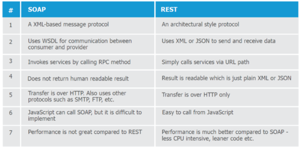

## Class 02 Reading Notes

Review, Research, and Discussion
In your reading notes page for this class, provide answers to the following prompts. Cite any external sources

**What’s the difference between PUT and PATCH?**

PUT should be an update that replaces all of the data with an updated one from the client.

PATCH should be a partial update that just changes some aspect rather than completely replace the prior data.

**Provide links to 3 services or tools that allow you to “mock” an API for development like json-server**

https://mswjs.io/

https://mockoon.com/

http://wiremock.org/

**Compare and contrast Swagger and APIDoc.js**

Swagger: 

- OpenAPI specification standard
- Open source
- Cloud based
- Allows for easy testing

APIDoc.js:

- An inline documentation tool for API stuff

**Which HTTP status codes should be sent with each type of (un)successful API call?**

404 - Not found

405 - Found, but not allowed (e.g. DELETE)

410 - Gone, was there but permanently deleted.

**Compare and contrast SOAP and ReST**

From: http://www.differencebetween.net/technology/internet/difference-between-rest-and-soap/

**Document the following Vocabulary Terms**

- Web Server - app that listens and does things based off of paths
- Express - web framework, full of useful middleware helps create servers
- Routing - how the app gets interacted with from the client
- WRRC - web request response cycle: https://www.travisluong.com/http-request-response-cycle/

### Preview

Skim the following materials in preparation for the upcoming lecture. Note the following as you browse the material, and be prepared to participate in discussions during lecture

**Which 3 things had you heard about previously and now have better clarity on?**

Express feels a bit more familiar.

The fact that status codes are basically just an agreed upon standard.

Testing - actually being able to put in our own tests is pretty neat.

**Which 3 things are you hoping to learn more about in the upcoming lecture/demo?**

Continuous Integration Continuous Delivery

TDD

**What are you most excited about trying to implement or see how it works?**

How to test more things: like console.logs for the logging test.

## Preparation Materials

An introduction to NodeJS and Express: https://developer.mozilla.org/en-US/docs/Learn/Server-side/Express_Nodejs/Introduction

What is NPM?: https://docs.npmjs.com/about-npm

What is TDD?: https://www.agilealliance.org/glossary/tdd/

Continuous Integration Continuous Delivery or CI/CD : https://www.youtube.com/watch?v=xSv_m3KhUO8

### Bookmark:

nodeJS docs: https://nodejs.org/en/docs/

npm docs: https://docs.npmjs.com/

express docs: https://expressjs.com/en/4x/api.html

http status codes: https://www.restapitutorial.com/httpstatuscodes.html

supertest: https://github.com/visionmedia/supertest

## Class 02 Live Notes

What is express?

A framework that gives us access to methods and properties that a server would need to use for a server to respond to requests. (HTTP SERVER)

A server created from express is an HTTP server.

`const app = express()` - app can be modified.
    - singleton creates an object 

Express middleware: any function that goes between the request and the response.

How does middleware pass the request to another function? 
- Using the `next` function.

How does middleware complete the request?
- By running a method on the `response` object.

HTTP: Request and Response
 - Request?: Something that is requesitng data/info
    - Client is asking the server to do something
    - Some object { method, headers, body}
 - Response?: What is sent back after the server does what the client requests?
    - The thing that is sent back that should contain the data.
    - Server's way of communicating back to the client
    - Object with methods and properties  {body, headers, status}

    ## Complex Express Apps

    Express gives you access to `request` and ` response` as long as we give the framework functions that can get the data from the request, and send responses back to the client, express will not have any issues.

Supply serverwide middleware.
- If you need a feature/function to happen for every request, we can add that using `app.use` at the top of the server file.
- Logging - Log every request that comes through the server.