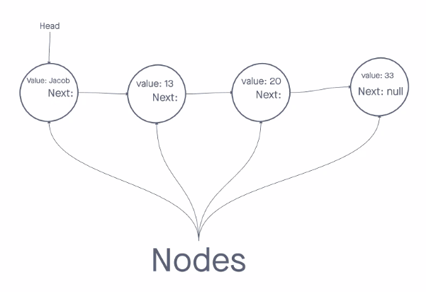

## Class 05 Reading Notes

Linked List is a sequence of Nodes.

Each Node references the next.

Terminology:

Linked List: A data structure that links/points to the next node.

Singly: The number of references inside of a node. A `Singly` linked list has only one rererence that goes to the `Next` one.

Doubly: Two references within a node. Reference to both the `Next` and the `Previous`.

Node: The items/links inside the a linked list.

Next: A property that must be in a node that references the next one.

Head: First node in a linked list.

Current: The node that is currently being looked at.

## Class 05 Live Notes Data Structures and Algorithms - Linked Lists

### Overview 

Applications and behaviors, abstract concepts.

Code challenges for the next week will use these. Help you gain perspective on how to solve problems with your language (very common basic problems).

### Solving Problems with Data Structures

Abstract problems, a single specific solution? Every prob has some ideas / params that is required.

Storing more than one things in a variable?

```
let number = 1;

let numbers = [1,2];

numbers.push(3);

```

These are a data structure, but not one we made.

What / Why?

- If js did not come with an array, how could we store things in the same place?
    - The array links things together, but we might need to know how to do that on our own

- Other languages have super weak arrays
    - Java and C# don't have dynamic arrays
    - Have to define a size
    - Devs could use a linked list to move items from one array to the next
- In JS we can just stick to an array

- Do we do this on the job?
    - Not exactly, but the knowledge will help you solve problems.

Analysis of Algorithm Efficiency - Big O
    - What makes one function / algorithm better than another?

#### What is a Big Oh?

A way to evaluate the performance of an algorithm.

The upper bound of time to execute.

Used to reach Optimal by looking at the Worst case of efficiency first.


Efficiency based off of two factors:

1. Running Time: Amount of time a function needs to complete.

- Time in milliseconds from start of a function until it ends
- Number of operations that are executed: How many lines are rerun
- 

2. Memory Space: Amount of memory resources a function uses to store data and instructions.


At this stage in tech, computers have a lot of space, and this should not affect us.

##### Input Size

How large are our parameters?
    - Size of a string.
    - Size of an array.
    - Object with 2 properties.

##### Example Loops

Everytime you nest a loop you are multiplying the running time by n.

Each loop is an exponent of n.

``` js


// n * n -> n^3
function analyzeMe(n) {

    let name = 'jacob';

// will run n times
for (let i = 0; i < n; i +=1) {   

    name += i;
    // will run n times for every n times
    for (let j = 0; j < n; j +=1) {

        name += j;

         console.log(i); // basic operation
    }
  }
}

```

##### Example Binary Sort

```js

//arr = [1,2,3,4]; word case => 4

function binarySearch(arr) {
    // split input in half and search for result
    let mid = arr.length / 2;
    // only works on sorted data
    // compare mid with one index up and one index down
}

```


### What is a Linked List?

A linear series of values, connected by a link. A storage container much like an array.


### Terminology

 - Node: A container that makes up a linked list.
    - Value, any.
    - Next
- Head: The Node at the beginning.



### Implementation

```js

'use strict'

class Node {
    constructor(value) {
        this.value = value;
        this.next = null;
    }

}

class LinkedList {
    constructor() {
        this.head = null;
    }

    // take in a value and add it to our linked list

    // efficiency:
    // time 0(n) - linear time efficiency
    // space 0(1) - constant space efficiency

    append(value) {
        // empty linked list {head: null}
        let node = new Node(value);
        if(this.head === null) {
            this.head = node;
            return;
        }
        
        let currentNode = this.head;

        // traversal of a linked list. important!

        while (currentNode) {
            currentNode = currentNode.next;
        }
        
        // have reached the end when we are out of the loop

    }
}

let list = new LinkedList();

// let node = new Node(value);

// let node2 = new Node(13);
// let node3 = new Node(20);
// let node4 = new Node(33);

// list.head = node;
// list.head.next = node2;
// list.head.next.next = node3;
// list.head.next.next.next = node4;

console.log(JSON.stringify(list));
list.add('Jacob');
list.add()

```

### Traversals


## Class 05 CAP Notes

Go to market strategy (GTM Strategy).

Plan of organization, using inside and outside resources to deliver their unique value proposition to customers and achieve competitive advantage.

We must have a GTM Strategy for yourself.

As you are interviewing, consider yourself the missing piece of that company.

The interview is not for some charity, it's because they have seen something in you that you can bring to the company.

Workshops will help you develop what you are bringing to a company.

## 7 Steps: Graduation -> Employment

1. Graduation, finish up 401.
2. Targeted Job Search - Being very intentional how you apply for jobs.
3. Need a stellar resume for this to be effective. It must be perfect.
4. Phone interview.
5. Whiteboarding/Technical Interview:

Have confidence, maintain a positive outlook (because you will get stuck).

Whiteboards are a collaborative process (even if you do 90% of it).

6. Behavioral interview to see if you can deal with them.

Tell me about a time where you made a mistake.

What would happen if you were part of a team and you found out 3/4 of the team members were out of covid.

How well can you articulate what happened in the past?

7. Offer/Counteroffer

"You limit yourself on the top end. If you made $70K, most Co. will meet you at that price. Start as high as possible and continue to grow the salary." - Scott

They want you to be comfortable and they want you to stay. There are very few people who can do it like you.

"Rule 1 to negotiate - never start with your salary requirement. Let them say what they want to pay." - Scott 

They need to pay you as a SME - Subject Matter Expert.

"Why should you hire me?" 

You're not hiring experience, you're hiring potential. You're hiring eagerness, a willingnless to grow, learn, and take risks.

See yourself as an asset?


## Unlocking the 7 Steps

Build your GTM strategy

### Personal Brand: Learner

The first thing I learned is I need to learn more.

"Want a learner over a learned person." - Scott 

Make your brand focusrd on software development - have this reflected on your LinkedIn.

Be very clear about your title and what it is, it should be consistent across everything.

### Resume 

Translate your skills: Understand the lingo

- Ran a daily meeting to review priorities: 
    - "Managed individuals to re-prioritize focus, find progress, find a plan, and avoid blockers."
    - "Overhauled daily standup meetings in agile work environemnt for a team of 6 employees, which boosted productivity 50%."
- Answered phones in a call center: 
    - "Engaged customers on a daily basis, providing direct communication to provide customer satisfaction."
    - "Performed root-cause analysis of customer issues, averaging 50 solved bugs daily, with a 98% satisfaction rating."
- Fixed leaky pipes: Debugged an issue through routing 
    - "Relentless troubleshooter for a complex network of industrial piping, developed strategu for 20% speed improvement in 80% of jobs."
- Created daily schedules for employees: 
    - "Lead a team and instructed direct staff of daily responsibilities to maintain a flowing team."
    - "Achived a detailed project plan to coordinate collaboration, ultimately resulting in a 35% reduction in overlaps."

Do not fudge numbers if you don't have access to the metrics.

#### Anatomy of a Resume

- Introduction
- Technical Skills & Tools
- Projects
- Education
- Experience

Keep out soft skills, volunteer stuff

#### Resume Analysis

Add: 
Languages: Javascript, HTML, CSS, Markdown, SQL, Bash

Skills and Tools: MongoDB, Express, React, Node.js, PostgreSQL, Axios, RESTful APIs, Bootstrap, VS Code, Git, GitHub, Metabase


## Partner Power Hour

1. Who was the speaker(s) and what company or companies were they from? What was the topic of the talk?

Raven Robertson with ticks and trips about going into your first tech job.

SIEM - Tool companies use to log traffic and find malicious activities.

Common to feel underqualified for positions.

- After Being Hired:

Understand what is expected of you: Find out your short term and long term goals.
Find a path to meet those goals: Identify the gaps. Start small, one small thing at a time.
Avoid analysis paralysis.

Identify who is on your team: Who does what, make sure to communicate. Need to know who you can or need to reach out to.

- Communicate Effectively

Determine what needs to be communicated and how: Is it a work ticket to unblock? Or just a quick question.
Be able to identify the goal of your conversation.
Prepare support docs
Actionable: state what you need to make it easy for them to help
Have empathy: they are likely busy as well
Have the right audience: Pay attention to what they are working on as well and show respect for their time and work.

- Take Notes

Take copious notes - make sure you don't have to ask the same question twice!

- Attitude

Don't be afraid to fail, but fail fast. Take exploratory steps

Take initiative: Be willing to take on tasks that combine your unique skillset.
Listen to feedback: Be open to criticism, ask stupid questions.

2. Share 1 or 2 ways the speaker’s information will change your approach to your career transition.

At any stage of the interview: Ask is there any reason you wouldn't move me forward to the next stage?

3. Do you have any other key take-aways, or observations about this Partner Power Hour?

Programming a tic-tac-toe terminal game sounds tough.

"Are there any other questions you have for me about my ability to do the job?"
