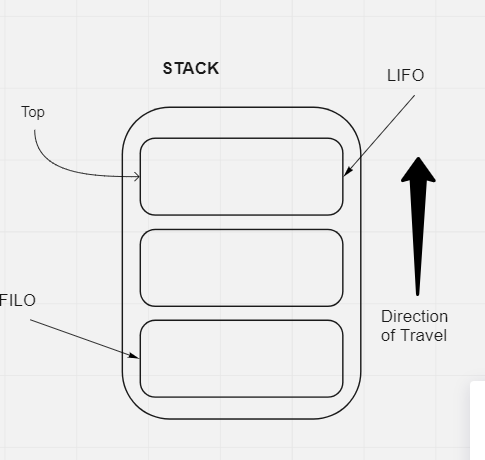

## Class 09 Reading: Stackes and Queues

What is a stack? 

A data structure of nodes.

Each node references the next node in the stack.

Stack Terms:

1. Push - Push a node into the stack.
2. Pop - Pop a node out of the stack.
3. Top - Top of the stack is revealed.
4. Peek - Peek at the top of the stack.
5. IsEmpty - IsEmpty when stack is empty.

Stack is FILO/LIFO - First In Last Out / Last In First Out

First item added will be last item out.



## Time and Space

Pushing a node into a stack is O(1).

Popping a node off a stack is O(1).

Peeking a stack is O(1).

IsEmpty is a O(1).

## Pseudocode

Pushing Pseudo:

```js
ALOGORITHM push(value)
// INPUT <-- value to add, wrapped in Node internally
// OUTPUT <-- none
   node = new Node(value)
   node.next <-- Top
   top <-- Node

```

Popping Pseudo:

```js
ALGORITHM pop()
// INPUT <-- No input
// OUTPUT <-- value of top Node in stack
// EXCEPTION if stack is empty

   Node temp <-- top
   top <-- top.next
   temp.next <-- null
   return temp.value
```

Peeking Pseudo:

```js
ALGORITHM peek()
// INPUT <-- none
// OUTPUT <-- value of top Node in stack
// EXCEPTION if stack is empty

   return top.value
```

IsEmpty Pseudo:

```js
ALGORITHM isEmpty()
// INPUT <-- none
// OUTPUT <-- boolean

return top = NULL
```

## What is a Queue?

Terms:

1. Enqueue - Add nodes.
2. Dequeue - Remove nodes.
3. Front - First node.
4. Rear - Last node.
5. Peek - Look at the Front Node.
6. IsEmpty - True when empty, false when not.


FIFO/LILO - First in First Out / Last In Last Out


## Time and Space

Enqueue: O(1)

Dequeue: O(1)

Peek: O(1)

IsEmpty: O(1)

## Pseudocode

Enqueue
```js
ALGORITHM enqueue(value)
// INPUT <-- value to add to queue (will be wrapped in Node internally)
// OUTPUT <-- none
   node = new Node(value)
   rear.next <-- node
   rear <-- node
```

Dequeue
```js
ALGORITHM dequeue()
// INPUT <-- none
// OUTPUT <-- value of the removed Node
// EXCEPTION if queue is empty

   Node temp <-- front
   front <-- front.next
   temp.next <-- null

   return temp.value
```

Peek
```js
ALGORITHM peek()
// INPUT <-- none
// OUTPUT <-- value of the front Node in Queue
// EXCEPTION if Queue is empty

   return front.value
```

IsEmpty
```js
ALGORITHM isEmpty()
// INPUT <-- none
// OUTPUT <-- boolean

return front = NULL
```