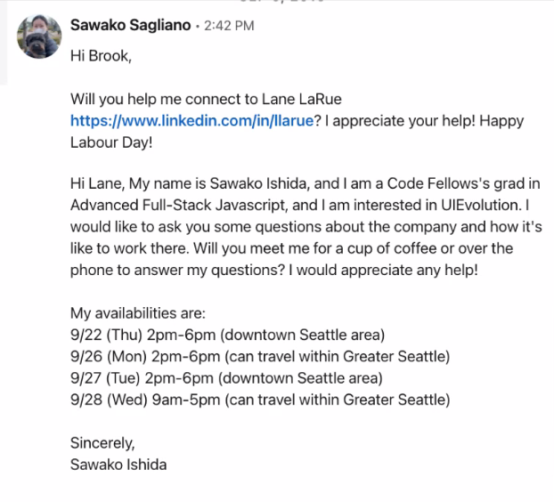

## Class 10 Reading: Stackes and Queues

What is a stack? 

A data structure of nodes.

Each node references the next node in the stack.

Stack Terms:

1. Push - Push a node into the stack.
2. Pop - Pop a node out of the stack.
3. Top - Top of the stack is revealed.
4. Peek - Peek at the top of the stack.
5. IsEmpty - IsEmpty when stack is empty.

Stack is FILO/LIFO - First In Last Out / Last In First Out

First item added will be last item out.


## Time and Space

Pushing a node into a stack is O(1).

Popping a node off a stack is O(1).

Peeking a stack is O(1).

IsEmpty is a O(1).

## Pseudocode

Pushing Pseudo:

```js
ALOGORITHM push(value)
// INPUT <-- value to add, wrapped in Node internally
// OUTPUT <-- none
   node = new Node(value)
   node.next <-- Top
   top <-- Node

```

Popping Pseudo:

```js
ALGORITHM pop()
// INPUT <-- No input
// OUTPUT <-- value of top Node in stack
// EXCEPTION if stack is empty

   Node temp <-- top
   top <-- top.next
   temp.next <-- null
   return temp.value
```

Peeking Pseudo:

```js
ALGORITHM peek()
// INPUT <-- none
// OUTPUT <-- value of top Node in stack
// EXCEPTION if stack is empty

   return top.value
```

IsEmpty Pseudo:

```js
ALGORITHM isEmpty()
// INPUT <-- none
// OUTPUT <-- boolean

return top = NULL
```

## What is a Queue?

Terms:

1. Enqueue - Add nodes.
2. Dequeue - Remove nodes.
3. Front - First node.
4. Rear - Last node.
5. Peek - Look at the Front Node.
6. IsEmpty - True when empty, false when not.


FIFO/LILO - First in First Out / Last In Last Out


## Time and Space

Enqueue: O(1)

Dequeue: O(1)

Peek: O(1)

IsEmpty: O(1)

## Pseudocode

Enqueue
```js
ALGORITHM enqueue(value)
// INPUT <-- value to add to queue (will be wrapped in Node internally)
// OUTPUT <-- none
   node = new Node(value)
   rear.next <-- node
   rear <-- node
```

Dequeue
```js
ALGORITHM dequeue()
// INPUT <-- none
// OUTPUT <-- value of the removed Node
// EXCEPTION if queue is empty

   Node temp <-- front
   front <-- front.next
   temp.next <-- null

   return temp.value
```

Peek
```js
ALGORITHM peek()
// INPUT <-- none
// OUTPUT <-- value of the front Node in Queue
// EXCEPTION if Queue is empty

   return front.value
```

IsEmpty
```js
ALGORITHM isEmpty()
// INPUT <-- none
// OUTPUT <-- boolean

return front = NULL
```

## Scott Lease's Quiz

What command would you use to remove a node from the top of the stack?

How many directions can we traverse through our nodes in a stack?

If we added "node 5" to a queue, what command would we use?

Why do we reset the temp when popping a node off the stack?

What could you tell me about the term Front in pertaining to queues?

Where does pop remove from the stack?

What do you need to create to remove a node from the stack?

What is the Big(0h) factor? of a push?

What does FILO stand for?

What does LIFO stand for?


## Class 10 Live Notes: Career Coaching Workshop - Personal Pitch and LinkedIn

### The Pitch: The Story Of You

A succinct introduction to yourself and your background.

Having an outline pitch is a great confidence booster for graduate interviews, networking events, and career fairs.

Personal pitch highlights what is important to you and important to them. Don't tell them your *entire* life story.

Stay in the professional space.

Your pitch is:

- Professional
    - Yet personal
- Showing positivity
- Showing passion
- More than just the words

### Key Elements of a Great Pitch

- What is they WHY behind your why? What brought you here and Why are you motivated to be here in this industry.
   - e.g. "my family needs security", "my creativity needs to advance something", "this is a childhood dream"

- What beliefs drive you?

- What values do you highlight?

- Tell it as a story 
    - Background of the hero (you)
    - Discovery, challenge, or obstacle
    - Skills to save the day!

    "That's beautiful thing about humanity is we can change direction."

### Your Pitch May Include

Background Industry or Environment
- Prior to being a technologist
- Example: Event coordinator and wedding planner

Key Strengths and Values Formed
- Can work with a diverse range of clients with a specific set of needs
- High pressure situations with strict deliverable dates

Destination
- Software Dev?
- Interested in
- Claim jargon

### Where Your Pitch is Utilized

- Presentations
- Networking: Virtual and In-Person
- Outreach Emails
- LinkedIn Connection Requests
- Informational Interviews
- Profile statements
- Phone interviews
- On Site interviews
- Meeting your new team.

### Using Your Pitch: Linkedin Intros

Ask first-degree connections for intros
Include your pitch
Address it to the new connection 



Think about your network

## High Level Summary

- Why did you decide to learn technical skills?
    - Express your values: "I believe"
    - What attracted you 
    - Why did you pick this specific skill?

- What were you doing before you made this pivot?
    - Early Indicators?
    - Previous experiences that make you a better technologist
    - Professional competencies that are your strengths

Ideal environ: How you would use this skill?

## LinkedIn Like A Pro

Have a professional headshot.

Look professional.

Background should look nice and display your personality

## About (Summary)

- Express your personality
- Place to insert your personal and technical pitch
- Write in first person but minimize use of I


## Experience and Educatin

- Must match resume but contain more history. Resume only gets most relevant history.
- Potential employers want to see consistency between these two materials.
- Cleanly formatted without duplicating too much.

## Skills

Spend time getting this right.

- Any skills you add, LinkedIN will automatically sort them into "buckets"

- Stay away from fluffy tech like MS Word/Office

- It should be clear that you ahve the development chops needed.

- Take the skill quizzes most relevant to your skill-set.

- Endorse classmates, and ask them to endorse your skills.

## Projects

Add projects, personal projects to your LinkedIn that are relevant to highlight your development skills.

Link your mideterm and final projects, they must be polished and professional looking. Free from grammatical errors.

Network with your team members on the project as collaborators.

Projects should be free of fluff:
- What did you build
- Why did you build it
- What are the key technologies

## Expand Your Network

Add connections!

## Other Tips

- Follow influencers
- Find company's or person's page and click follow
- THese follows will show up at the bottom of your page
- Keep your linkedinpage and resume updated and in alignment
- Give recommendations to people in your network

