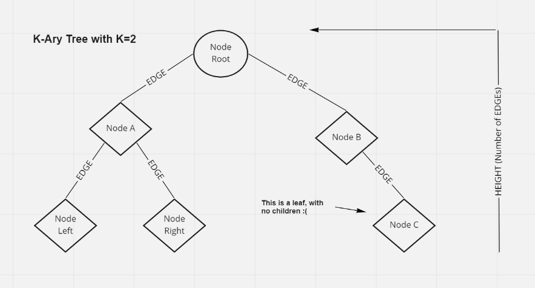
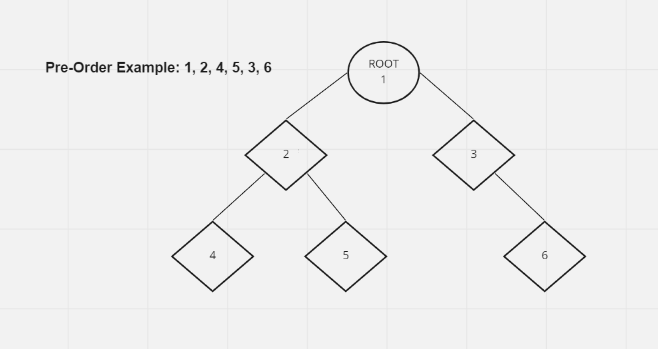
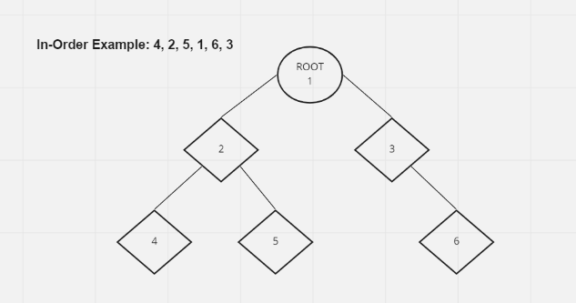
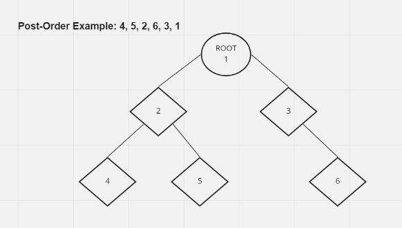

# Class 15 Reading Notes: Trees

Binary Trees, Binary Search Trees, and K-Ary Trees

### Terms Defined:

- Node: A tree node references other nodes.
- Root: The beginning ofthe tree.
- K: The max number of children a node may have in a K-ary tree.
- Left: In a binary tree, one side.
- Right: In a binary tree, another side.
- Edge: Link between a parent and a child node.
- Leaf - A tree node with no children.
- Height: Number of edges from root to last leaf.

### Tree Drawing - K-Ary - K=2

Demonstrates the above vocabulary.



### Traversals

How to traverse a tree (two methods).

- Depth
- Breadth

### Depth Traversal

Going through the entire height.

- Pre-Order: root -> left -> right



Pseudocode:
```
ALGORITHM preOrder(root)

  OUTPUT <-- root.value

  if root.left is not NULL
      preOrder(root.left)

  if root.right is not NULL
      preOrder(root.right)

```

- In-Order: left -> root -> right



Pseudocode:
```
ALGORITHM inOrder(root)
// INPUT <-- root node
// OUTPUT <-- in-order output of tree node's values

    if root.left is not NULL
        inOrder(root.left)

    OUTPUT <-- root.value

    if root.right is not NULL
        inOrder(root.right)

```

- Post-Order: left -> right -> root



Pseudocode:
```
ALGORITHM postOrder(root)
// INPUT <-- root node
// OUTPUT <-- post-order output of tree node's values

    if root.left is not NULL
        postOrder(root.left)

    if root.right is not NULL
        postOrder(root.right)

    OUTPUT <-- root.value

```

Recursion is the most common way through a tree. Have to rely on the call stack to navigate back up to the root. 
