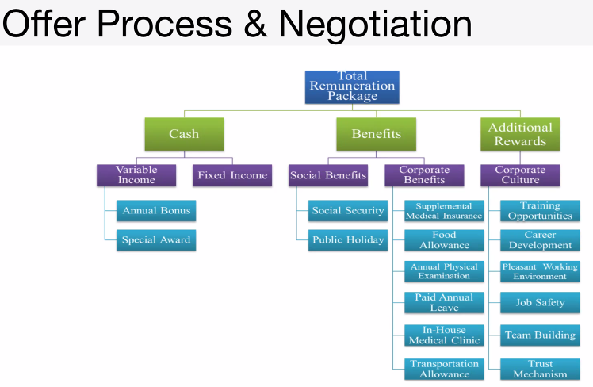

# Class 15 Reading Notes: Trees

Binary Trees, Binary Search Trees, and K-Ary Trees

### Terms Defined:

- Node: A tree node references other nodes.
- Root: The beginning ofthe tree.
- K: The max number of children a node may have in a K-ary tree.
- Left: In a binary tree, one side.
- Right: In a binary tree, another side.
- Edge: Link between a parent and a child node.
- Leaf - A tree node with no children.
- Height: Number of edges from root to last leaf.

### Tree Drawing - K-Ary - K=2

Demonstrates the above vocabulary.


### Traversals

How to traverse a tree (two methods).

- Depth
- Breadth

### Depth Traversal

Going through the entire height.

- Pre-Order: root -> left -> right


Pseudocode:
```
ALGORITHM preOrder(root)

  OUTPUT <-- root.value

  if root.left is not NULL
      preOrder(root.left)

  if root.right is not NULL
      preOrder(root.right)

```

- In-Order: left -> root -> right


Pseudocode:
```
ALGORITHM inOrder(root)
// INPUT <-- root node
// OUTPUT <-- in-order output of tree node's values

    if root.left is not NULL
        inOrder(root.left)

    OUTPUT <-- root.value

    if root.right is not NULL
        inOrder(root.right)

```

- Post-Order: left -> right -> root


Pseudocode:
```
ALGORITHM postOrder(root)
// INPUT <-- root node
// OUTPUT <-- post-order output of tree node's values

    if root.left is not NULL
        postOrder(root.left)

    if root.right is not NULL
        postOrder(root.right)

    OUTPUT <-- root.value

```

Recursion is the most common way through a tree. Have to rely on the call stack to navigate back up to the root. 

# Class 15 Live Notes: Trees

Linked List: Linear sequence of Nodes
- Queue: Apply a ruleset (FIFO) - read in the same order in which nodes were added.
- Stack: Apply a ruleset (FILO) - read in the reverse order in which nodes were added.

## Tree Overview 

A nonlinear organization of nodes, with a hierarchy.

## Terminology / What is a tree:

- Root - Beginning
- Node - Container for data, but now more than one.
    - value: data storage
    - left: a child node that sits to the left
    - right: a child node that sits to the right
    - children: a list or array (iterable/linear) that contains children

- Edge - A connection between two nodes, always has a direction ( a branch)
- Leaf - A node with 0 children.
- Height - The number from the root to the furthest leaf.
- Levels - The height plus 1

### Types of Trees

**Binary Tree**: A type of three whose nodes only have a max of 2 children.

**K-Ary**: A tree whose nodes have a max of `K` children.

**Binary Search Tree**: A binary tree whose values are sorted. Usually containing integers, with lower values on the left, and greater on the right.
    - Balanced Trees: Trees that have the left and right subtrees differ by no more than 1
    - Unabalanced trees are inefficient to traverse.
    - Perfect Tree: Has all nodes filled on all levels


## Traversals 

Lot of variety in the order in which we read:

#### Depth First

Reading all the values from one subtree before looking at values from other subtree.

Pre-Order: current -> left -> right

In-Order: left -> current -> right

Post-Order: left - right - > current

#### Breadth First

Reading all the values on the current level before reading values on the children's level.

Still go left to right.

# Binary Tree

```js
"use strict";

class Node {
  constructor(value) {
    this.value = value; 
    this.left = null;
    this.right = null;
  }
}


/** Recursive function
 * base case: case in which you do not call yourself
 * recursive case: case in which you call the function again
 */

class BinaryTree {
  constructor(){
    this.root = null;
  }
}

const tree = new BinaryTree();
let node1 = new Node(13);
let node2 = new Node(15);
let node3 = new Node(24);
let node4 = new Node(34);
let node5 = new Node(6);
let node6 = new Node(11);

tree.root = node1;
tree.root.left = node2;
tree.root.right = node3;
tree.root.left.left = node4;
tree.root.left.right = node5;
tree.root.right.left = node6;

console.log(preOrder(tree.root));
console.log("##############################################")
console.log(inOrder(tree.root));
console.log("##############################################")
console.log(postOrder(tree.root));


function preOrder(node) {

  console.log(node.value);

  if (node.left) {
    preOrder(node.left);
  };

  if (node.right) {
    preOrder(node.right);
  };

}

function inOrder(node) {
  
  if (node.left) {
    inOrder(node.left);
  };
  console.log(node.value);

  if (node.right) {
    inOrder(node.right);
  };

}

function postOrder(node) {
  if (node.left) {
    inOrder(node.left);
  };
  

  if (node.right) {
    inOrder(node.right);
  };

  console.log(node.value);
}


```


# Kary Trees

```js
'use strict';

class Node {
    constructor(value, k) {
        this.value = value;
        this.children = new Array(k);
    };
};

class KaryTree {
    constructor(k) {
        this.root = null;
        this.k = k;
    };
};

let tree = new KaryTree(3);

let root = new Node(13, tree.k);
let node2 = new Node(15, tree.k);
let node3 = new Node(24, tree.k);
let node4 = new Node(34, tree.k);
let node5 = new Node(6, tree.k);
let node6 = new Node(11, tree.k);

tree.root = root;
tree.root.children[0] = node2;
tree.root.children[1] = node3;

tree.root.children[0].children[0] = node4;
tree.root.children[0].children[1] = node5;
tree.root.children[0].children[2] = node6;

breadthFirst(tree.root);

function breadthFirst(root) {

   
    let queue = [];
    let current = null;
    queue.unshift(root); // adds something to the end of the array on the opposite end of push
    while(queue.length) {

        // move current to the next node in the queue
        current = queue.pop();

        // read current node
        console.log(current.value);

        // add current nodes children
        for (let child of current.children) {
            if(child){
                queue.unshift(child);
            }
            
        };
        


    };
};

```


=====================================================================================================================

# John Cokos Job Search Lecture

## High Volume Search

John Cokos talking about job descriptions brought up a lot of information with regards to job searching and application.

High volume searching is where 500+ people are placing in their Resumes which go through ATS - apparently this is why we have our CodeFellows resume formatted the way it is.

Javascript AND (web OR application OR software OR full* OR front* OR back*) AND (develop* OR programm* OR eng*)

https://docs.google.com/spreadsheets/d/1PGylOhiYIuDMLcGr6iUdMNSVwCwczWovbr1HqSRXBGA/edit?usp=sharing

## Cover Letter

Follow directions

Customize for the position - specifically mention things at the company and go after them 

"You need to hire me because I want to make these changes. I'm a problem solver."

Languages, frameworks, tools.

No more than 3 paragraphs.

Proofread and ask someone else to proofread.

## Cover Letter: Value Proposition

Research and think through what you can **build/make/suggest** for the company
- Offer a detailed feature suggestion
- Find and describe a bug in their prod or website
- Check for bug bounty programs they may offer like HackerOne
- Make a PR to their public Github repo
- Find a syntax error on the website
- Write a code that illustrates a suggest change or fix

This will illustrate a keen interest in the company

## Best Practices - Targeted Search

- Make multiple points of contact within the company
- Don't worry about it if they have job postings live
- Write and review cover letters
- Subscribe to newsletters, blogs, and news alerts
- Create an account if their job portal requires it
- Build and maintain a network of connections
- Find out how to make the hiring manager's job easier

## Networking

Provide, not consume.

Hard and awkward.

Most jobsa re filled before they are posted.

85% of jobs come from networking! 

Networkers often get bonuses for new hires.

## Networking is NOT:

- Selling

- Collecting cards

- Being disingenous 

- Not dismissing someone

- Not talking without giving

- Not a Prom Dance wall

## How Do I Network?

- Start before you need it

- Start with your existing base

- Be a host or greeter

- Have your pitches ready

- Always approach with "how can I help?"

Art of small talk: 
- Ask questions
- Find common ground
- Reveal something
- Look for the passon or problem

Get a business card / LI connect (and keep notes)

## Coffee Meetings

- What are your biggest concerns?
- Build your own plan to get mentored
- Reach out to those who can offer what you want

Where can you find people to ask?
- Your existing network
- People from your previous career
- Your existing network's network
- Your instructor, campus staff
- Speakers we bring to campus
- Our alumni network
- People you meet at events
- People at companies you like
- People at companies you want to work at
Use zoom, 30 min, use the agenda. Easier cause they don't have to drive

What do you think you should ask?

Follow up with gratitude, amplification.

## Where Do I Start?

Event Pages
- EventBrite
- GeekWire
- New Tech NW
- Startup Digest
- Startup Seattle
- Meetup.com
- Company hosted events
- Career development
- LinkedIn Groups

- Join associations
- Join a group
- Volunteer
- Informational coffees

Do things you love!


## Here is the ROI

**Opportunities**: Create opportunity

- Build your network
- Partnerships / Friendships / Community
- Leads and Intros
- Promotion - Boost Reputation
- Speaking - Writing Gigs
- Joint ventures

## Offer Process & Negotiation

Research and know the market

- Find out the average
- Look at the glassdoor and indeed salary information
    - Don't trust their reviews
- See wha their interviw process is like

## Offer Process & Negotiation 2

Be confident! You have the skills
- Documentation
- Teamwork
- Leadership
- Projets

Every day write in the ReadMe and update it.

Software Skills:
- Clean Code
- Automated tests




Intangibles are very useful

e.g. Getting paid to go to class 

## Offer Process & Negotation Process

Compensation and Benefits

Restricted Stock Units
401k Matching

## Prepare to Negotiate

They expect it!

- Research them
- Be excited for the opportunity
- Draw attention to why yo applied
- Self-worth and skillful confidence
- Research data points = Respect
- Large company salary research
- Negotiate

## Prepare to Negotiate 2

Which is better? $75k salary +
- $10k signing bonus
- OR +$5k base?
 
Which is better?

## Prepare to Negotiate 3

IF they decline because you're new

Get a list of deliverables that you can bring in results for in 6 months to prove your capability and link that to a salary increase.

# Partner Power Hour: Emily with Git

1. Who was the speaker(s) and what company or companies were they from? What was the topic of the talk?

Speaker was Emily Kapor-Mater who was an alumni of CodeFellows talking about Git "How the heck does Git work anyway?"

2. Share 1 or 2 ways the speaker’s information will change your approach to your career transition


Emily's talk was less career oriented, but gave absolutely vital information with regards to using Git. 
One major point was that GitHub isn't actually a server and the user isn't actually just a client.

Maybe I'll make much better git commit messages which will help my future co-workers.

3. Do you have any other key take-aways, or observations about this Partner Power Hour?

- Commits are just a set of instructions to add or delete a set of lines.

Learned what the Hunk Header is and what it actually means.

I just learned `take` which combines mkdir and cd which I definitely will be using from now on.

`git add .` to add an entire directory. Don't add unless you're very sure about it.
`git diff` shows difference between two commits
`git log` needs to be used more often to see the history of git commits
Use `git status` more often!
- Current Branch
- `git help branch` to see useful branch commands.

A branch is just a pointer to a commit. The repository remains unchanged

Make good and useful commit messages!


