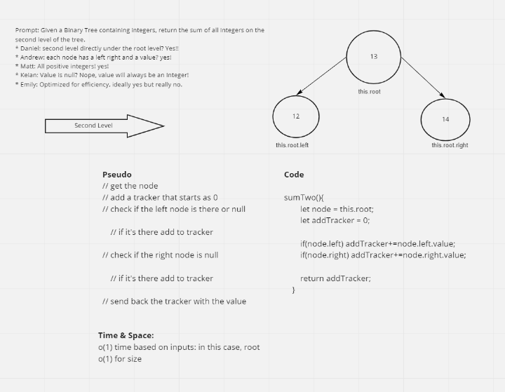

# Class 16 Reading: AWS: Cloud Servers

**Describe the Web-Request-Response-Cycle**

Client (usually a browser) makes a `request` to server. If the server is able to, and has the path it sends a `response`.

**Explain what a “server” is, as it relates to the WRRC**

Server is the second contact point, with the origination coming from the client/user machine.

**What does it mean to “deploy” an application?**

The application is set up on an environment that isn't just on a local environment, allowing access from clients over the internet.

### Document the following Vocabulary Terms

Server: The endpoint system that receives requests from the client via HTTP or a WRRC.

Pub/Sub: The Publish/Subscribe Pattern which uses a messaging pattern

WRRC: Web Request Response Cycle - an initialism that describes the process HTTP

## Sources

https://backend.turing.edu/module2/lessons/how_the_web_works_http

https://en.wikipedia.org/wiki/Web_server

https://en.wikipedia.org/wiki/Publish%E2%80%93subscribe_pattern

## Virtual Machines: 
https://www.youtube.com/watch?v=yIVXjl4SwVo

## Introduction to Virtualization: 
https://www.youtube.com/watch?v=l0DfHUWMjsU

## EC2 for Humans: 
https://www.youtube.com/watch?v=lZMkgOMYYIg

## Introduction to AWS Elastic Beanstalk:
https://www.youtube.com/watch?v=SrwxAScdyT0

## Amazon EC2:
https://aws.amazon.com/ec2/

## Class 16 Lives Notes/Learning Journal

We did a bit of presentations today of projects.

Aside from our game, I think my favorite was the socki-talki chat app. It was very well done and I liked seeing their code as an example of what could be done.

## Warmup/Whiteboard

## AWS Notes

Amazon Web Services

- Dev Ops: Where does our Code Run? Does it work in that environment.
    - Low code week
    - No new design patterns
    - Everyday this week will be a new AWS product

Why learn EC2 and Elastic Beanstalk?

- Because doing 

Provision a Virtual Machine 

Elastic Beanstalk: Allows Web Services to be configured and deployed on EC2 instances (virtual machine)

Amazon employs a CDN, or Content Delivery Network to make sure that our server/software is load balanced.

CDN puts our software on multiple machines around the country/world.

Wants to know:

Environment? Node/Linux

EC2 - Computers running in the cloud.
Heroku - it uses Elastic Beanstalk, one step above that takes care of what we are about to do.

I learned I can use `explorer.exe .` to access my Linux files quickly and easily using Ubuntu.

## AWS Deploy Checklist

- [ ] Mercury
- [x] Venus
- [x] Earth (Orbit/Moon)
- [x] Mars
- [ ] Jupiter
- [ ] Saturn
- [ ] Uranus
- [ ] Neptune
- [ ] Comet Haley